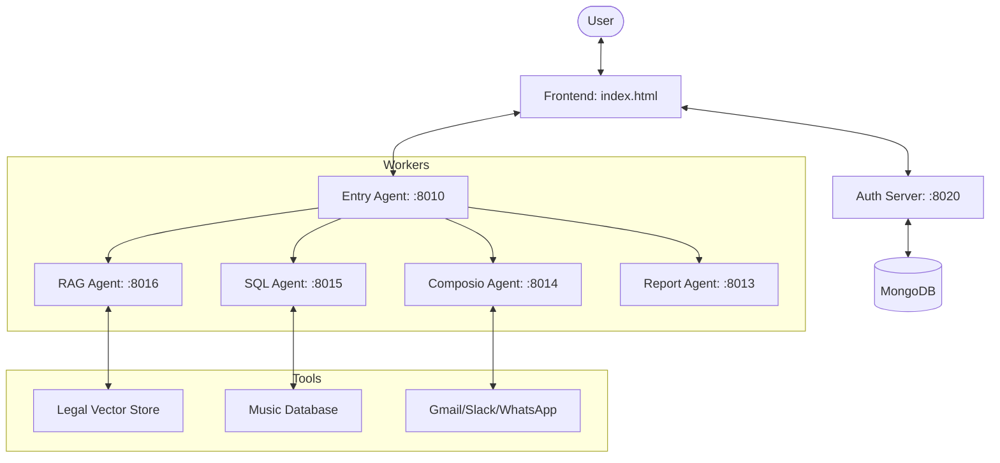

# Nexus MAS Architecture

Nexus is a persistent, session-aware Multi-Agent System (MAS) designed for complex task orchestration across various data sources (SQL, RAG, Web).

## 1. System Overview

The project is built on three main pillars:
1.  **Persistent Storage**: MongoDB-backed session and chat history.
2.  **Intelligent Orchestration**: An Entry Agent that plans tasks and restores conversation context.
3.  **Context-Aware Workers**: Specialized agents (RAG, SQL, etc.) that resolve ambiguous queries using history before execution.

---

## 2. Component Deep-Dive

### A. Frontend (`index.html` / `styles.css`)
- **Session Management**: Every conversation is isolated in a unique session. The UI proactively initializes a session via `POST /me/sessions` on every "New Query" click.
- **State Restoration**: On page load or session switch, the UI fetching `${AUTH_API}/me/sessions/{id}/chats` to restore the message view and blackboard context.
- **Health Checks**: Integrated heartbeats (`checkAuth`, `checkEntry`) monitor backend status every 5s and trigger auto-reconnection.

### B. Auth Server (`auth_server.py`)
- **Identity**: Manages JWT-based authentication and user channel connectivity (OAuth).
- **History Hub**: Acts as the bridge between the Agents and MongoDB. 
- **Blackboard Persistence**: Saves the "Blackboard" (agent shared memory) alongside every chat message, ensuring that data like "Current City: Delhi" persists between browser refreshes.

### C. Entry Agent (`agents/entry_agent/main.py`)
- **The Orchestrator**: Receives the raw user query and plan a multi-step execution.
- **Context Injection**:
    - Fetches the last 5 messages for the session from the Auth Server.
    - Searches backwards for the most recent valid `context_data`.
    - Merges this historical context into the current task's Blackboard.
- **Planner**: Uses a "Plan-the-Action" prompt to derive a dependency graph of agent calls.

### D. Worker Agents (RAG & SQL)
- **The Hallucination Fix**: Uses `agents/llm_utils.py -> rewrite_query()`.
    - **Original**: "Explain its section 4."
    - **History**: "User: What is the PDP Bill?"
    - **Rewritten**: "Explain section 4 of the Personal Data Protection Bill."
- **RAG Agent**: Uses FAISS for semantic search on Indian legal excerpts.
- **SQL Agent**: Uses natural language to SQL conversion for the Chinook database.

---

## 3. Data Flow: "The Lifecycle of a Query"

1.  **UI**: User clicks "New Query" -> Proactive Session created in DB -> `activeSessionId` set.
2.  **UI**: User types "How many albums does AC/DC have?" -> `POST /query` sent to Entry Agent.
3.  **Entry Agent**: 
    - Fetches session history from Auth Server.
    - Resolves context (none for first message).
    - Plans: `1. Call SQL Agent`.
4.  **SQL Agent**:
    - Receives instruction.
    - Calls LLM to generate SQL based on the natural language query.
    - Executes SQL via MCP tools and returns result count.
5.  **Entry Agent**: Finalizes result -> Returns to UI.
6.  **UI**: Calls `saveChat` -> Result + Blackboard (SQL results) saved to MongoDB linked to `activeSessionId`.
7.  **Follow-up**: User types "Send it to me via Gmail".
    -   **Rewriter** turns "it" into "The list of AC/DC albums".
    -   **Entry Agent** calls Composio Agent -> Gmail sent.

---

## 4. Key Implementation Patterns

- **Blackboard Pattern**: Agents communicate via a shared `context_data` dictionary (the Blackboard), managed by the `TaskStore`.
- **Model Context Protocol (MCP)**: A standardized bridge that allows LLM-based agents to call external Python functions/tools safely.
- **JWT Middleware**: All backend endpoints are guarded by JWT validation against the user database in MongoDB.
